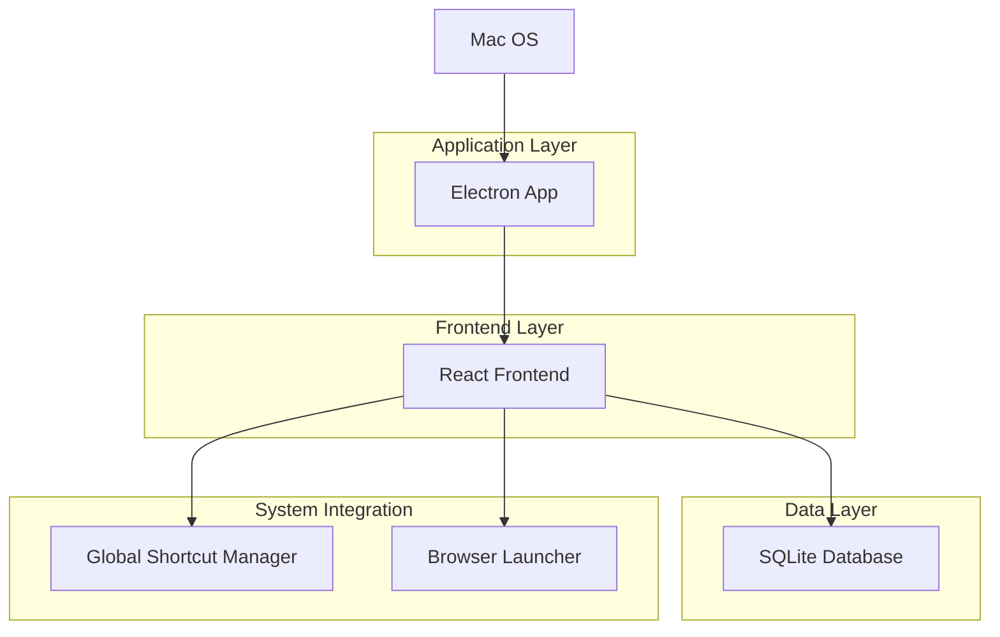
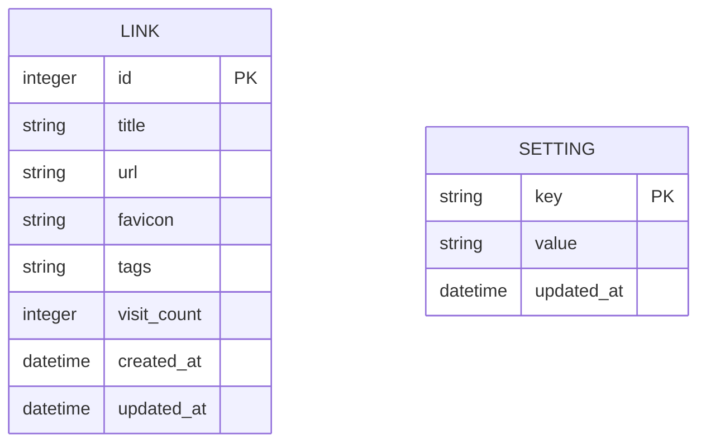
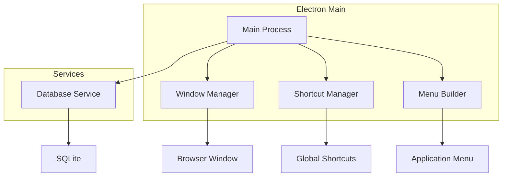

## 1. 架构设计



## 2. 技术描述

- **桌面框架**: Electron@27 + React@18
- **初始化工具**: electron-vite
- **UI框架**: tailwindcss@3
- **数据库**: better-sqlite3
- **打包工具**: electron-builder
- **快捷键管理**: electron-global-shortcut
- **图标获取**: node-fetch + cheerio

## 3. 路由定义

| 路由 | 用途 |
|-------|---------|
| / | 主界面，显示搜索框和链接列表 |
| /create | 创建链接页面 |
| /settings | 设置页面，配置快捷键和主题 |

## 4. 数据模型

### 4.1 数据模型定义



### 4.2 数据定义语言

链接表 (links)
```sql
-- 创建表
CREATE TABLE links (
    id INTEGER PRIMARY KEY AUTOINCREMENT,
    title TEXT NOT NULL,
    url TEXT NOT NULL UNIQUE,
    favicon TEXT,
    tags TEXT,
    visit_count INTEGER DEFAULT 0,
    created_at DATETIME DEFAULT CURRENT_TIMESTAMP,
    updated_at DATETIME DEFAULT CURRENT_TIMESTAMP
);

-- 创建索引
CREATE INDEX idx_links_title ON links(title);
CREATE INDEX idx_links_url ON links(url);
CREATE INDEX idx_links_created_at ON links(created_at DESC);
```

设置表 (settings)
```sql
-- 创建表
CREATE TABLE settings (
    key TEXT PRIMARY KEY,
    value TEXT NOT NULL,
    updated_at DATETIME DEFAULT CURRENT_TIMESTAMP
);

-- 初始化数据
INSERT INTO settings (key, value) VALUES 
('global_shortcut', 'Command+Shift+L'),
('theme', 'dark'),
('window_width', '600'),
('window_height', '400');
```

## 5. 核心API定义

### 5.1 链接管理API

```typescript
// 链接数据类型
interface Link {
  id: number;
  title: string;
  url: string;
  favicon?: string;
  tags?: string;
  visit_count: number;
  created_at: Date;
  updated_at: Date;
}

// 搜索链接
GET /api/links/search?q={keyword}
Response: Link[]

// 创建链接
POST /api/links
Request: { title: string; url: string; tags?: string }
Response: Link

// 更新访问计数
PUT /api/links/:id/visit
Response: { success: boolean }

// 删除链接
DELETE /api/links/:id
Response: { success: boolean }
```

### 5.2 设置管理API

```typescript
// 获取设置
GET /api/settings
Response: Record<string, string>

// 更新设置
PUT /api/settings
Request: { key: string; value: string }
Response: { success: boolean }
```

## 6. 主进程架构



## 7. 性能优化

- **数据库**: 使用索引优化搜索性能
- **内存管理**: 定期清理不常用的favicon缓存
- **启动速度**: 延迟加载非关键模块
- **搜索算法**: 实现模糊匹配和全文搜索
- **缓存策略**: 缓存常用链接和搜索结果