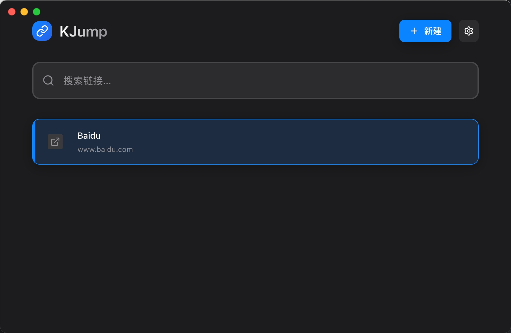

# KJump

[English](#english) | [中文](#中文)


A keyboard-first link manager inspired by Raycast, built with Electron, React, TypeScript, and Vite.



## English

### What it is

KJump is a lightweight desktop app for quickly saving, searching, and opening links. It also includes a simple daily task view.

### Highlights

- Fast search over your saved links
- Keyboard-first navigation (no mouse required)
- Quick create from URL input
- Tag filtering
- Local storage: SQLite in Electron, `localStorage` fallback in browser mode

### Keyboard shortcuts

**Global (works system-wide)**

- Toggle main window: `Alt+Space`
- Jump to tasks view: `Alt+Shift+T`

**In-app**

- Navigate list: `ArrowUp` / `ArrowDown`
- Open selected: `Enter`
- Close dialog / blur input: `Escape`
- Delete selected: `Cmd+Backspace` / `Cmd+Delete` (macOS), `Ctrl+Backspace` / `Ctrl+Delete` (Windows/Linux)
- Switch to tasks view: `Cmd+T` / `Ctrl+T`

### Install

**Option A: Download**

- Get the latest installer from GitHub Releases: `https://github.com/kangyujian/kjump/releases`

**Option B: Build from source**

Prerequisites:

- Node.js `>=16` (recommended: latest LTS)
- npm

```bash
npm install
```

### Development

```bash
npm run dev
```

### Lint

```bash
npm run lint
```

### Build (pack installers)

```bash
npm run build
```

Build artifacts are generated in `release/<version>/`:

- macOS: `KJump-Mac-<version>-Installer.dmg`
- Windows: `KJump-Windows-<version>-Setup.exe`
- Linux: `KJump-Linux-<version>.AppImage`

### Data location and backup

In Electron mode, the database file is `links.db` under Electron `userData`:

- macOS: `~/Library/Application Support/KJump/links.db`
- Windows: `%APPDATA%\\KJump\\links.db`
- Linux: `~/.config/KJump/links.db`

To back up, quit KJump and copy `links.db` to a safe location.

In browser mode (when `window.electronAPI` is not available), data is stored in `localStorage` under the key `kjump_links`.

### Troubleshooting

- `better-sqlite3` install errors: make sure native build tools are installed (macOS: `xcode-select --install`), then re-run `npm install`.
- Global shortcut not working: other apps may already bind `Alt+Space`. Change it in `electron/main.ts` and rebuild.

### Project structure

- `src/`: Renderer (React UI)
- `electron/`: Main & preload scripts
- `dist-electron/`: Compiled Electron output
- `release/`: Packaged installers

### Release notes

See `RELEASE_NOTES.md`.

## 中文

### 这是什么

KJump 是一款轻量的桌面链接管理工具，支持快速保存、搜索与打开链接；同时提供一个按天查看的任务页面。

### 核心特性

- 快速搜索已保存链接
- 键盘优先交互（尽量不需要鼠标）
- 输入 URL 后快速创建
- 标签筛选
- 本地存储：Electron 使用 SQLite，浏览器模式自动回退到 `localStorage`

### 快捷键

**全局快捷键（系统级）**

- 显示/隐藏主窗口：`Alt+Space`
- 跳转到任务页面：`Alt+Shift+T`

**应用内快捷键**

- 列表上下移动：`ArrowUp` / `ArrowDown`
- 打开选中项：`Enter`
- 关闭弹窗/输入框失焦：`Escape`
- 删除选中项：macOS `Cmd+Backspace` / `Cmd+Delete`，Windows/Linux `Ctrl+Backspace` / `Ctrl+Delete`
- 切换到任务页面：macOS `Cmd+T`，Windows/Linux `Ctrl+T`

### 安装

**方式 A：直接下载**

- 从 GitHub Releases 获取最新安装包：`https://github.com/kangyujian/kjump/releases`

**方式 B：源码构建**

环境要求：

- Node.js `>=16`（建议使用最新 LTS）
- npm

```bash
npm install
```

### 开发

```bash
npm run dev
```

### 代码检查

```bash
npm run lint
```

### 打包构建

```bash
npm run build
```

产物位于 `release/<version>/`：

- macOS：`KJump-Mac-<version>-Installer.dmg`
- Windows：`KJump-Windows-<version>-Setup.exe`
- Linux：`KJump-Linux-<version>.AppImage`

### 数据存储与备份

Electron 模式下，数据库为 `links.db`，位于 Electron 的 `userData` 目录：

- macOS：`~/Library/Application Support/KJump/links.db`
- Windows：`%APPDATA%\\KJump\\links.db`
- Linux：`~/.config/KJump/links.db`

备份方式：退出 KJump 后，将 `links.db` 复制到安全位置即可。

浏览器模式（即 `window.electronAPI` 不存在）会将数据写入 `localStorage`，key 为 `kjump_links`。

### 常见问题

- `better-sqlite3` 安装失败：先安装本机构建工具（macOS：`xcode-select --install`），再重新执行 `npm install`。
- 全局快捷键无效：`Alt+Space` 可能被其他应用占用；可在 `electron/main.ts` 修改组合键后重新打包。

### 目录结构

- `src/`：渲染进程（React UI）
- `electron/`：主进程与 preload
- `dist-electron/`：Electron 编译输出
- `release/`：各平台安装包

### 更新日志

见 `RELEASE_NOTES.md`。

## License

MIT
